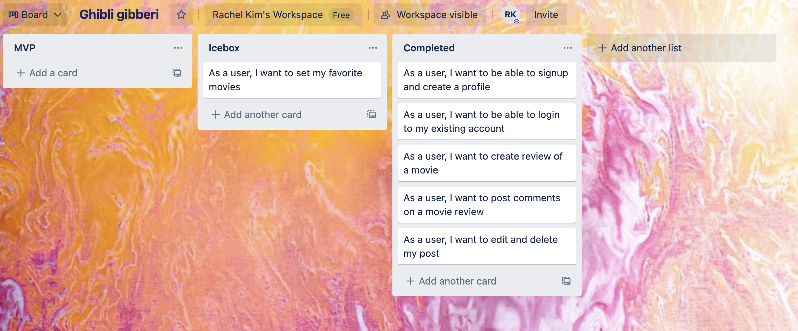
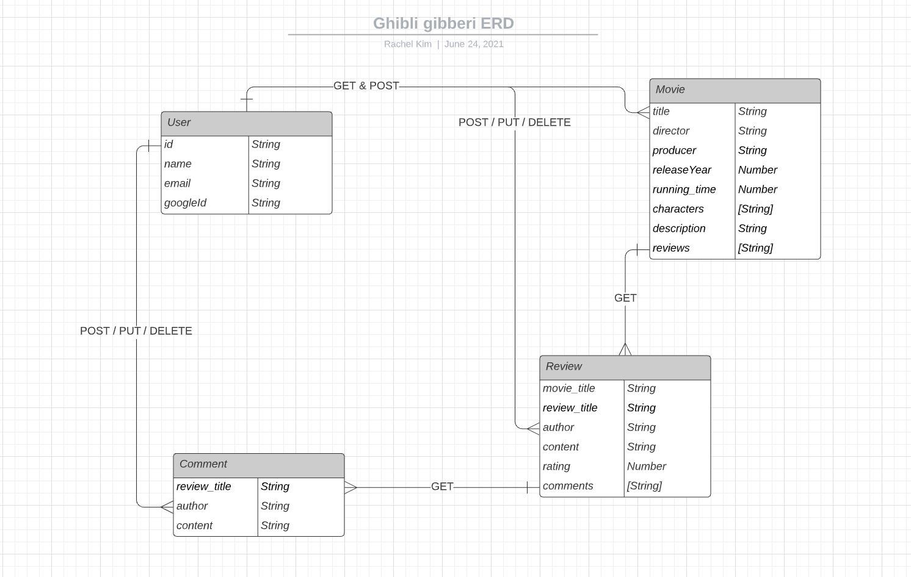
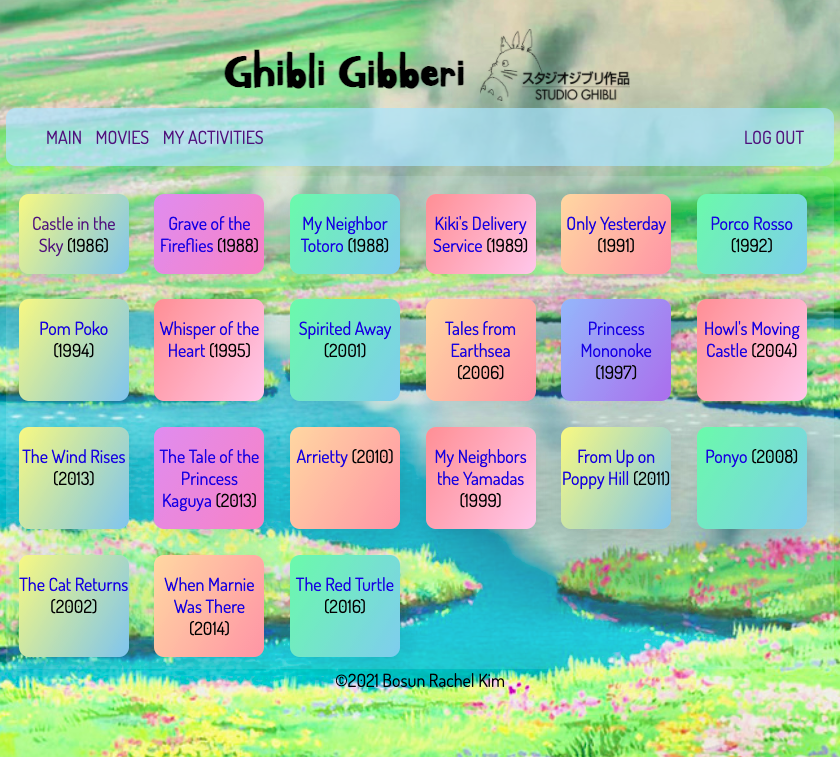
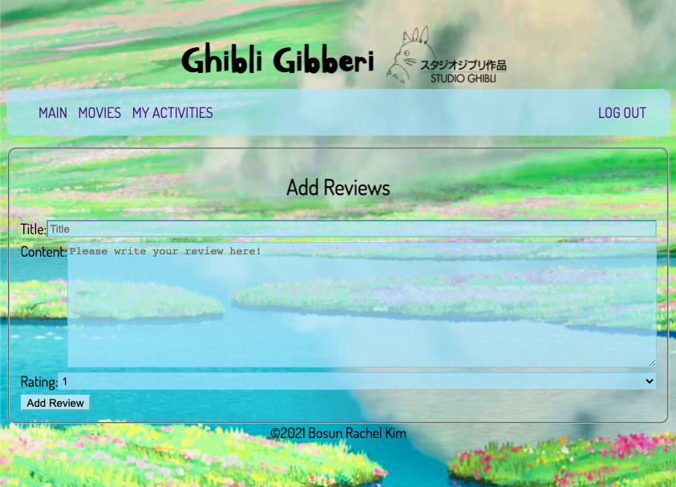
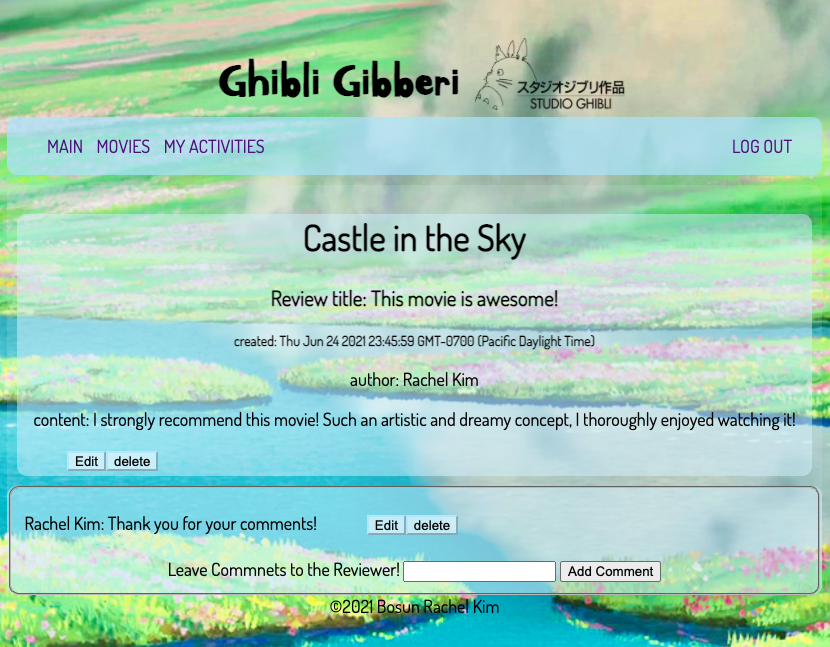
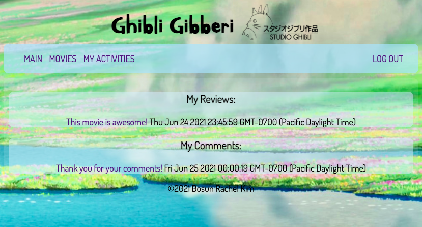

# Ghibli Gibberi
Hi, thank you for checking out my project! This project is my first web app that uses HTTP CRUD methods. You can log in with your google account to create, update, and delete reviews on Studio Ghibli movies! Moreover, you can interact with other people by commenting to each other's reviews.

### Link to my web app is here [https://ghibligibberi.herokuapp.com/](https://ghibligibberi.herokuapp.com/).

#### API used: Thanks to @janaipakos for *Studio Ghibli API* base URL: https://ghibliapi.herokuapp.com.

## Skills Used: MongoDb, Express.js, Mongoose.js, Node.js
_____________________________________
**Trello Board:**

**ERD**

**Use Case**

You can login with your google account.

If you click MOVIES tab, it will show list of movies from Studio Ghibli! Clicking a card will reveal the detail of that movie.

On the movie detail page, you can click 'Add Review' button to create new review on the movie.

Add Review page.

You can click review title from movie detail page then it will direct you to review detail page. On this page you and other users can freely add comments on the review.

You can check your activity on your 'My Activities' page!

**Enjoy!**
